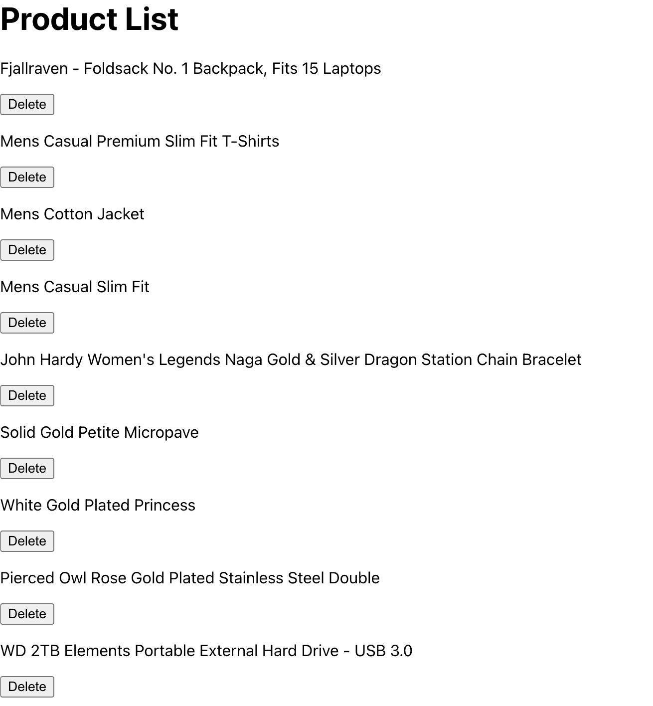
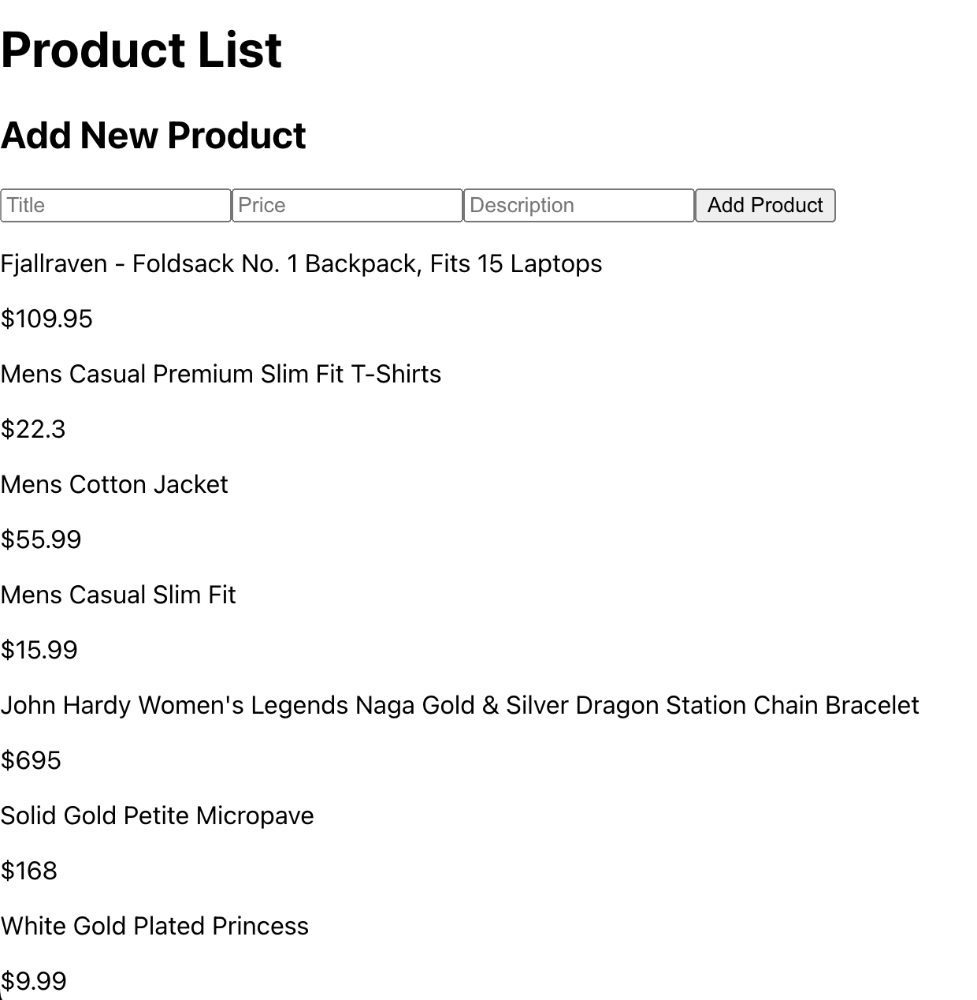
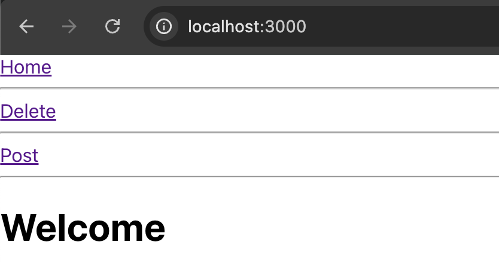
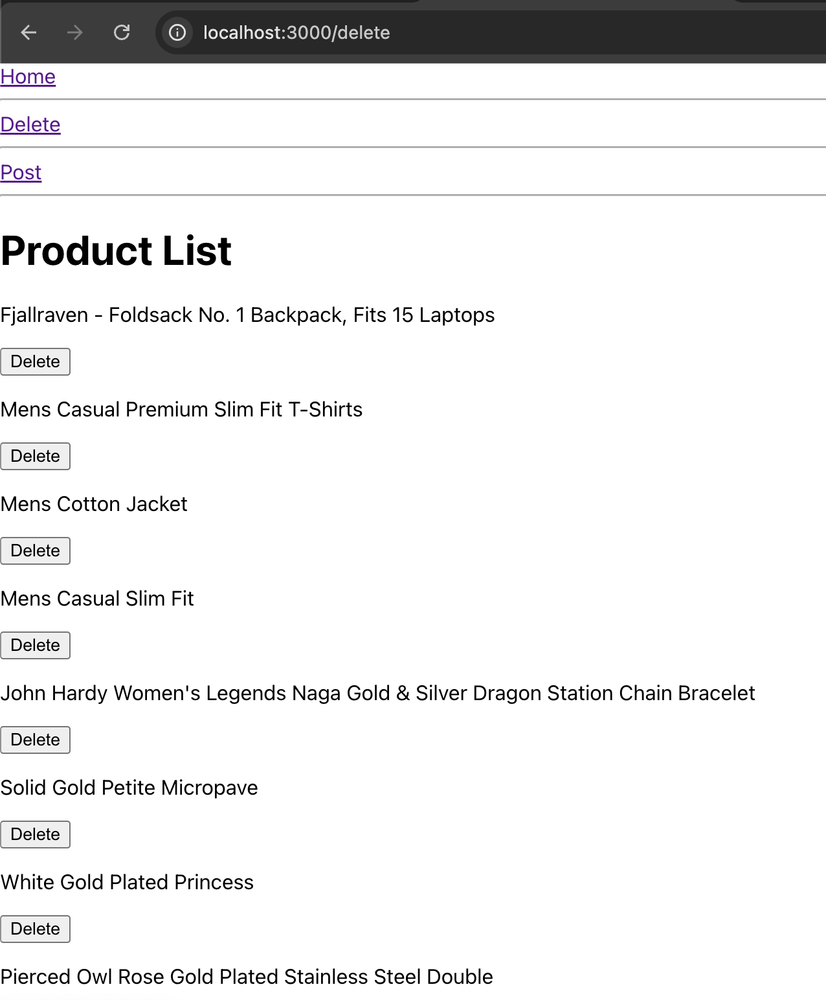
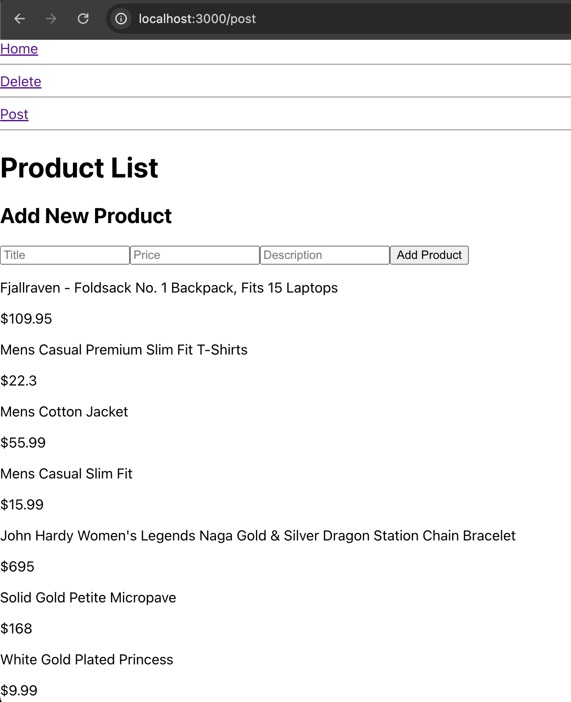
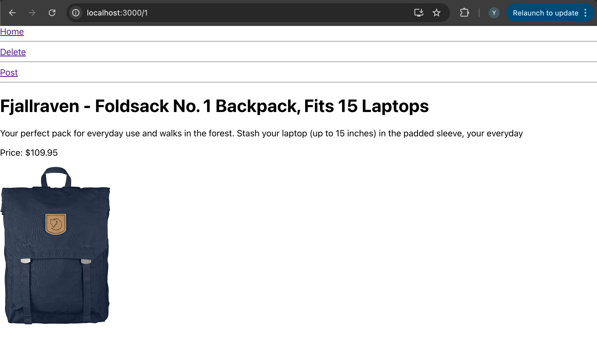
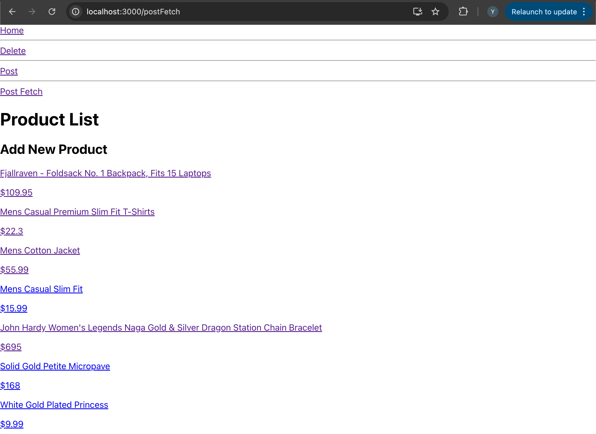
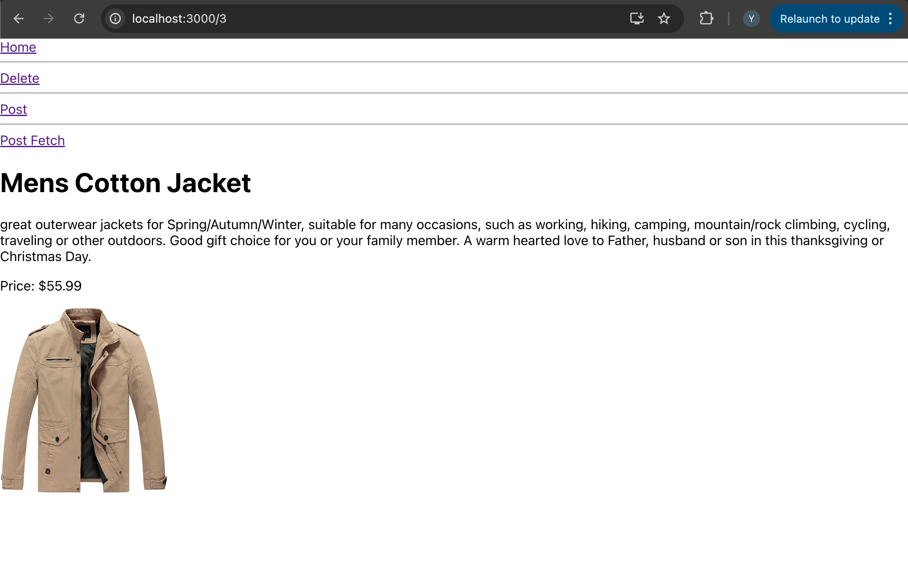
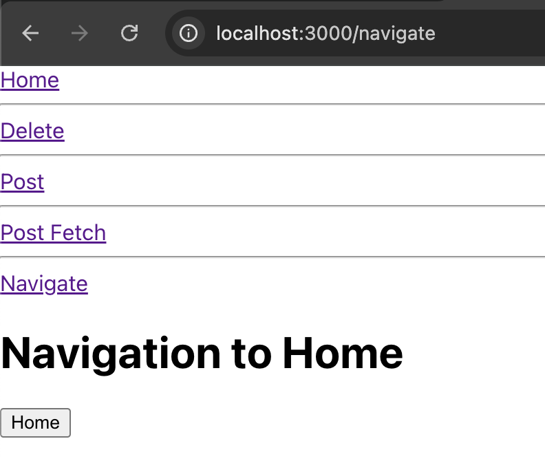

# Activity 1 – Fetch Image & Response.json()

### Objective
Fetch a random dog image from an external API (Dog CEO API) and display it in the app when the page loads.

### Instructions
1. Create `fetch.js` in src folder, import `useEffect` and `useState` from React.
2. Define a state variable `dogImage` using `useState` to store the URL of the dog image.
3. Inside `useEffect`, define an asynchronous function named `fetchDogImage` to fetch data from the URL: `https://dog.ceo/api/breeds/image/random`.
4. Use `fetch()` to make the request and call `.json()` on the response to parse it as a JavaScript object.
5. Set the `dogImage` state variable to `data.message`, which contains the URL of the fetched dog image.
6. Display the image in the JSX if `dogImage` has a value.

### Output(Random dog image)

# Activity 2 – DELETE Request

### Objective
Implement a function to delete a specific product from the product list by sending a DELETE request to the Fake Store API. Update the local state to reflect the change in the UI.

### Instructions
1. Create `delete.js`, define a state variable `products` using `useState` to store the list of products.
2. Use `useEffect` to fetch the initial product list from the Fake Store API (`https://fakestoreapi.com/products`) and set it in the `products` state.
3. Create an asynchronous function called `deleteProduct` that accepts a product `id` as a parameter.
4. Inside `deleteProduct`, use the `fetch` API with the DELETE method to remove the product by its `id` from the Fake Store API.
   - Use the URL format `https://fakestoreapi.com/products/{id}` where `{id}` is the product ID.
   - Pass an object as the second argument in `fetch` with `method` set to `'DELETE'`.
5. After the DELETE request, update the `products` state to remove the product with the specified `id` so the UI updates accordingly.
6. Render the list of products, each with a "Delete" button, that calls `deleteProduct` with the respective product `id` when clicked.

### Output

# Activity 3 – POST Request

### Objective
Implement a function to add a new product to the product list by sending a POST request to the Fake Store API. Update the local state with the response from the API, which includes the new product with an automatically generated ID.

### Instructions
1. In `post.js`, define a state variable `products` using `useState` to store the list of products.
2. Use `useEffect` to fetch the initial product list from the Fake Store API (`https://fakestoreapi.com/products`) and set it in the `products` state.
3. Create an asynchronous function called `addProduct` that accepts a new product object as a parameter.
4. Inside `addProduct`, use the `fetch` API with the POST method to add the new product to the Fake Store API.
   - Use the URL `https://fakestoreapi.com/products`.
   - Pass an object as the second argument to `fetch` with:
     - `method` set to `'POST'`
     - `headers` set to `{"Content-Type": "application/json"}`
     - `body` set to `JSON.stringify(newProduct)` to send the product data as a JSON string.
5. Receive the response from `fetch`, parse it with `.json()`, and add the returned product (which includes the new ID) to the `products` state to update the UI.
6. Render a simple form to add a new product, with fields for title, price, and description, and a button to submit.

### Output

# Activity 4 – Setting Up Navigation and Reading URL params

### Objective
Use React Router to create a navigation system that allows switching between three different components/pages: `Home`, `Delete`, and `Post`.

### Instructions

1. **Set Up the Navigation Component**:
   - Create a file named `Navigation.js` (or `navigation.js` depending on your naming convention).
   - Inside this file, set up `BrowserRouter` as `Router` and define three links:
     - **Home** (path: `/`)
     - **Delete** (path: `/delete`)
     - **Post** (path: `/post`)

2. **Define Routes**:
   - Use the `<Routes>` and `<Route>` components from `react-router-dom` to define routes for each page.
   - Each route should render a specific component:
     - `/` renders `<Home />`
     - `/delete` renders `<Delete />`
     - `/post` renders `<Post />`

3. **Create the `Home`, `Delete`, and `Post` Components**:
   - Make sure each component (`Home`, `Delete`, and `Post`) exists in its own file and is exported properly.

4. **Add Basic Styling** (optional):
   - Add `
` elements between the links for better visual separation.

### Output

### Output

### Output

# Activity 5 – Reading URL params 

## Objective
Add a dynamic route (`/:id`) to display detailed information for each product. This requires setting up the `Detail` component to fetch and display specific product details based on the ID.

## Instructions

1. **Create a new file** named `detail.js` in your project’s folder.
2. **Import** the necessary modules:
   - `useEffect` and `useState` from React to manage the product data and side effects.
   - `useParams` from `react-router-dom` to retrieve the dynamic `id` from the URL.

3. **Initialize Component Logic**:
   - Use `useParams` to get the `id` of the product from the URL.
   - Set up a state variable `product` using `useState` to store the product details.

4. **Fetch Product Data**:
   - Inside `useEffect`, define an asynchronous function `fetchProduct` that:
     - Fetches product data from `https://fakestoreapi.com/products/${id}`.
     - Parses the response to JSON and updates `product` state.
   - Call `fetchProduct` within `useEffect` so that it runs each time the `id` changes.

5. **Render Product Details**:
   - Check if `product` is available. If so, display its title, description, price, and image.
   - If `product` is not available (e.g., data is still loading), display a loading message.

### Output
url: http://localhost:3000/1

# Activity 6 – Fetch user responsible for a specific task

## Instructions

### Part 1: Create the `PostFetch` Component

1. **Fetch Products**:
   - Use `useEffect` to fetch products from `https://fakestoreapi.com/products` when the component loads.
   - Save the fetched product data to the `products` state.

2. **Render Product List**:
   - Map through the `products` array and display each product’s title and price.
   - Wrap each product in a `Link` component that navigates to `/${product.id}`, allowing users to view detailed information about the product.

### Part 2: Update the Navigation Component

1. **Import Components**:
    - Ensure PostFetch, Delete, Post, Home, and Detail components are all imported at the top of the file.

2. **Add Navigation Links**:
    - Add a <Link> for Post Fetch to navigate to /postFetch.

3. **Define Routes**:
    - Set up a route for PostFetch at /postFetch.
    - Set up a dynamic route for Detail at /:id, which displays detailed information for each product.

### Output

# Activity 7 – Navigate Programmatically

## Instructions

### Step 1: Create the `navigate` Component

1. **Define the Component**:
   - In your `navigate.js` file, create a new component called `Navigate`.
   
2. **Import `useNavigate`**:
   - Import `useNavigate` from `react-router-dom`.
   
3. **Set Up the Navigation Logic**:
   - Use `useNavigate` to initialize the `navigate` function.
   - Set up a button that triggers `navigate("/")` when clicked, redirecting the user to the home page.

### Step 2: Update the Navigation Component

1. **Add Links to Other Components**:
   - In your main `Navigation` component (e.g., `Navigation.js`), create navigation links for each of the following components:
     - `Home`
     - `Delete`
     - `Post`
     - `PostFetch`
     - `Navigate`

2. **Set Up Routes**:
   - Define routes for each component:
     - Ensure the home page route (`"/"`) points to the `Home` component.
     - Add individual routes for `Delete`, `Post`, `PostFetch`, and `Navigate` components.
     - Include a route specifically for `"/navigate"` to render the `Navigate` component.

### Output

